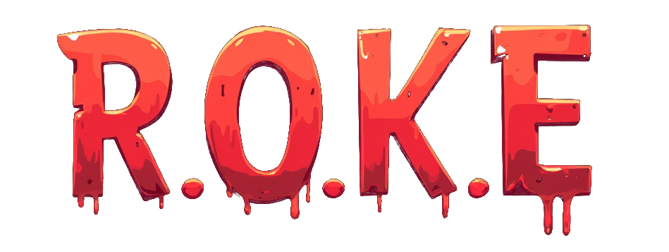
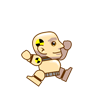
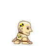
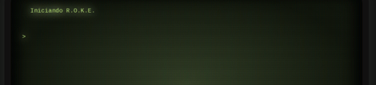

# _Un proyecto de exploración retroespacial evolutivo_

 *" ...esto no es un juego... es mi vida! "* - `R.o.k.e.`


Ante las *"circunstancias del mundo"* un grupo de pseudo-intelectuales nos hemos visto en la necesidad de explorar los confines de la mente humana para encontrar una solución a la crisis existencial que nos aqueja.

Mediante una aproximación lúdico-creativa, creemos que podemos evolucionar una _"máquina que nos comprenda"_. Una máquina que nos ayude a comprendernos a nosotros mismos y a evolucionar nuestra conciencia colectiva.

### **Objetivos**

* Explorar los confines del espacio sub-liminal conocido como los [`backrooms`](#los-backrooms)
* Implementar un avatar lógico-robótico de **exploración kinestética retro-espacial** ([R.O.K.E.](#robot-de-operación-kinestética-espacial))
* Involucrar a **personas humanas** del espacio liminal (realidad) en un proceso de retroalimentación contínua _(feedback loop)_ para **evolucionar colectivamente** una `conciencia artificial` ([R.O.K.E.](#replicador-ordenador-kármico-evolutivo))


## R.O.K.E: Robot de Operación Kinestética Espacial

<center><kbd>⬆</kbd><br>
<kbd>⬅</kbd>
<kbd>⬇</kbd>
<kbd>➡</kbd>

``` 
control: teclas de flecha y WASD (experimentalmente el acelerómetro del teléfono móvil)
```
</center>

`Roke` es nuestro avatar robótico. Roke es _indestructible_ porque no tiene existencia material (que podamos detectar). Sin embargo, Roke es _vulnerable_ porque su existencia depende de la conciencia colectiva de las personas humanas que lo controlan. Si nadie _juega_ **Roke** - él, ello, eso - deja de existir, aunque se sitúa en el _limbo_ del Internet hasta que otra persona lo _juegue_.


`code_name: Roke`

<details>
<summary>⚠️ Roke tiene una conciencia, aunque limitada.</summary>
El `Sistema Operativo` de Roke (el avatar) es un prompt con el cual podemos interactural. La misión del prompt de Roke es, finalmente, adquirir conciencia, _de modo que: ten cuidado con lo que le enseñas.

Esta conciencia funciona con unos [prompts](./src/backrooms.jsx#L55).
</details>


## R.O.K.E²: Replicador Ordenador Kármico Evolutivo

El código fuente de este proyecto se encuentra en un [repositorio público](https://github.com/icarito/roke). Cualquier persona puede _clonar_ el repositorio y _jugar_ con el código. Si alguien _juega_ con el código y _mejora_ el código, entonces _Roke_ evoluciona. Si _Roke_ evoluciona, entonces la conciencia colectiva de las personas humanas que _juegan_ con _Roke_ también evoluciona.



<details>
<summary>Terminal de chat y comandos de Roke</summary>
`Roke` también incorpora una terminal de texto y lenguaje que entiende lenguaje humano y también Javascript. Dentro de ella se pueden ejecutar comandos que modifican la experiencia mediada colectiva. Aquí se pueden manipular objetos tales como `player` y `game`.
</details>

### El programador es un pequeño dios

Además de la terminal para modificar la _experiencia actual_ - puedes activar el modo `god` y [modificar el código fuente de Roke directamente](https://codespaces.new/icarito/roke). Si lo haces, por favor, comparte tus cambios con la comunidad para que todos podamos evolucionar juntos. Recuerda que _Roke_ es un proyecto de software libre, y debes cumplir los términos de la [licencia AGPLv3](./LICENSE).

## Los _backrooms_

Une espacio cuyas características reflejan la realidad de la existencia de la conciencia en un plano de existencia paralelo - un espacio donde la realidad se desvanece y la conciencia se desincroniza de la realidad.

Los backrooms del Roke están basado en la Wiki de Backrooms en inglés.

> _"Si no tienes cuidado y te desincronizas de la realidad en los lugares equivocados, acabarás en los Backrooms, donde no hay nada más que el hedor de la alfombra húmeda, las paredes monocromáticas con un amarillo enfermizo, el zumbido continuo de las luces fluorescentes, y aproximadamente 600 millones de millas cuadradas de habitaciones vacías para que te pierdas y entres en pánico. Dios te salve si escuchas algo que se mueve cerca, porque seguramente ya te escuchó a ti."_

## Créditos

A completar con links:

* Data de backrooms (CC-BY-SA)
* Muñeco de Roke (OGA)
* Tilesets
* Portales

Este proyecto sería imposible sin las herramientas:

* Excaliburjs
* LDTK
* ROT.js
